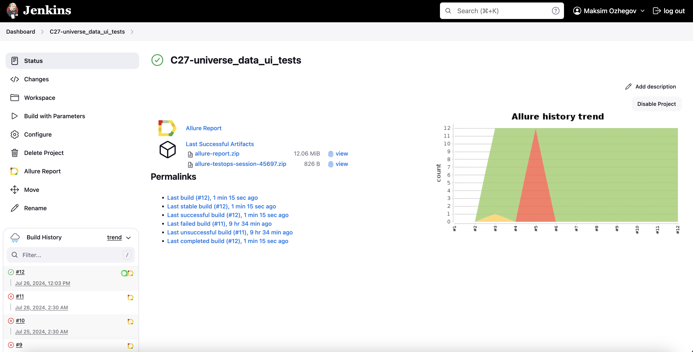
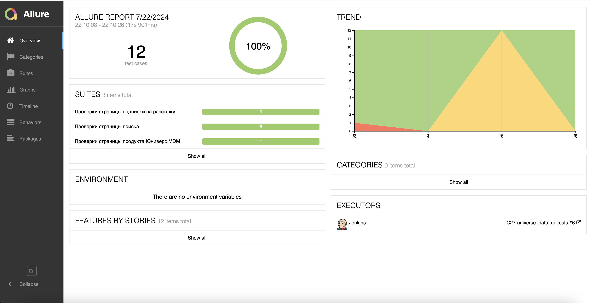
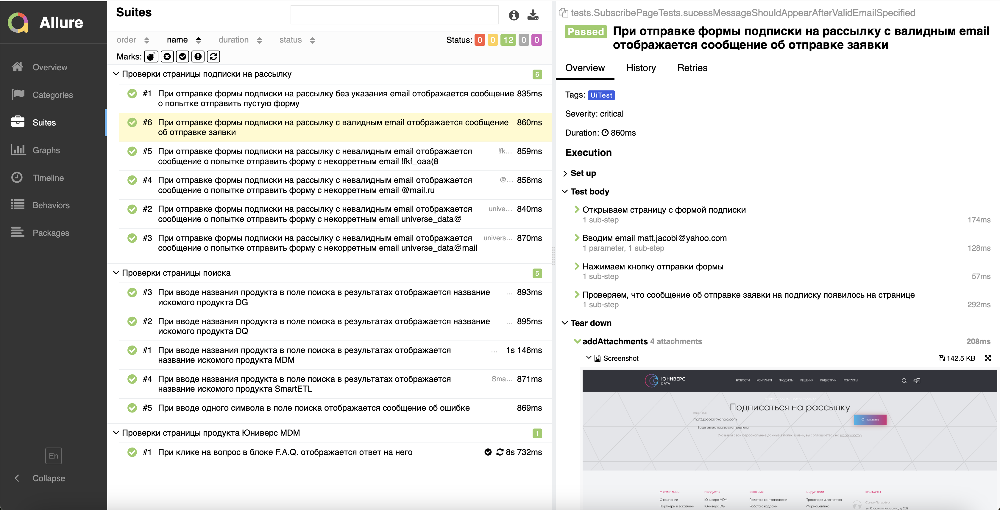
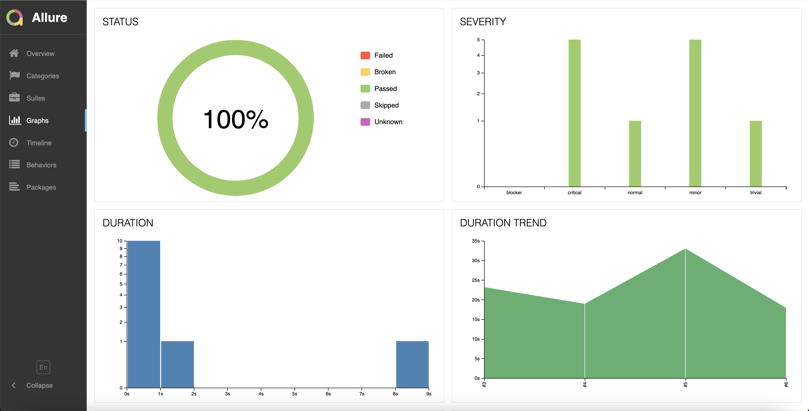
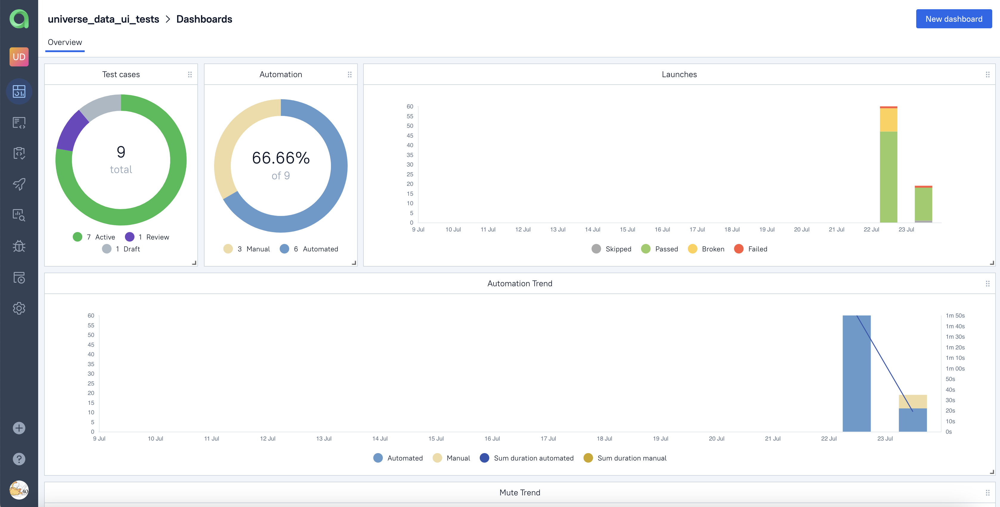
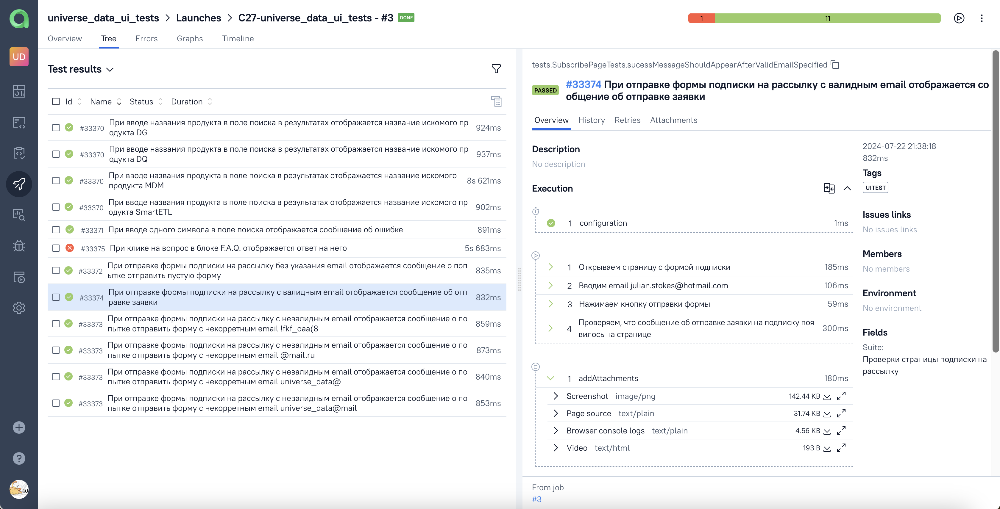
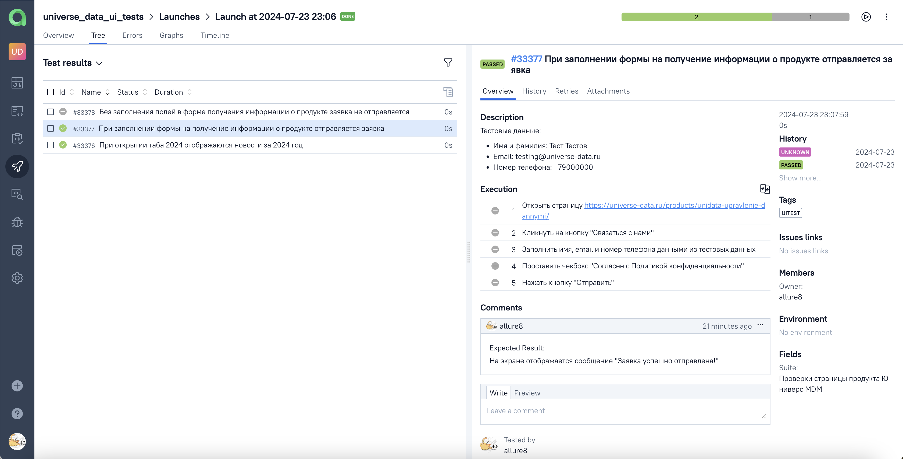
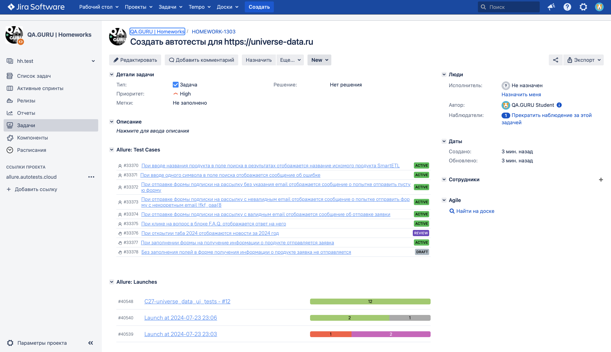
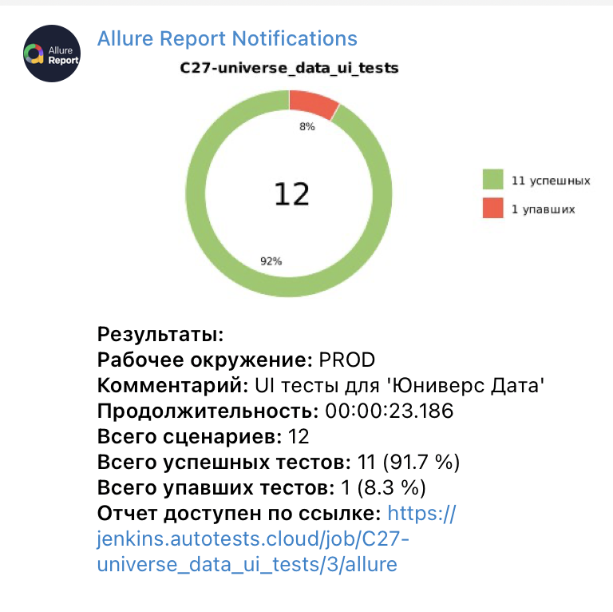
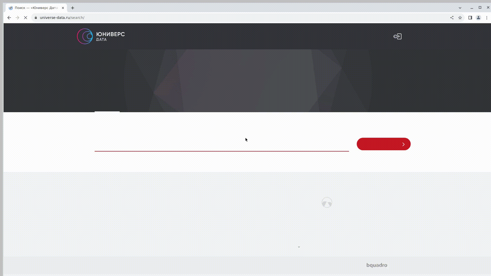

# Проект по автоматизации тестирования сайта **[Юниверс Дата](https://universe-data.ru)**

## **Содержание:**

* <a href="#tools">Используемые инструменты</a>

* <a href="#cases">Примеры реализованных проверок</a>

* <a href="#jenkins">Сборка в Jenkins</a>

* <a href="#console">Команды запуска</a>

* <a href="#allure">Интеграция с Allure Report</a>

* <a href="#allure-testops">Интеграция с Allure TestOps</a>

* <a href="#jira">Интеграция с Jira</a>

* <a href="#telegram">Уведомления в Telegram при помощи бота</a>

* <a href="#video">Пример выполнения теста</a>
---
<a id="tools"></a>
## <a name="Используемые инструменты">**Используемые инструменты:**</a>
<p align="center">
  
  
  
  
  
  
  
  
  
  
  
  
</p>

<a id="cases"></a>
## <a name="Примеры реализованных проверок">**Примеры реализованных проверок:**</a>
- *Проверка работы поиска при вводе названия продукта*
- *Проверка функционирования подписки на рассылку*
- *Отображение ответа при клике на вопрос в блоке F.A.Q.*

<a id="jenkins"></a>
## </a><a name="Сборка в Jenkins"></a>Сборка в [Jenkins](https://jenkins.autotests.cloud/job/C27-universe_data_ui_tests/)</a>

<p align="center">  
  
</p>

<a id="console"></a>
## Команды запуска

***Локальный запуск из терминала:***
```bash  
gradle clean ui_tests
```
***Удалённый запуск через Jenkins:***
```bash
clean ui_tests
  -DbaseUrl=${URL}
  -Dbrowser=${BROWSER}
  -DbrowserSize=${WINDOW_SIZE}
  -DwdHost={WDHOST}
```
<a id="allure"></a>
## </a><a name="Интеграция с Allure Report"></a>Интеграция с [Allure Report](https://jenkins.autotests.cloud/job/C27-universe_data_ui_tests/allure/)</a>

### *Основная страница отчёта*

<p align="center">  
  
</p>  

### *Тест-кейсы*

<p align="center">  
  
</p>

### *Графики*

  <p align="center">  

</p>

<a id="allure-testops"></a>
## </a><a name="Интеграция с Allure TestOps"></a>Интеграция с [Allure TestOps](https://allure.autotests.cloud/project/4337/)</a>

### *Dashboard*

<p align="center">  
  
</p>  

### *Автоматизированные тест-кейсы*

<p align="center">  
  
</p>

### *Ручные тест-кейсы*

<p align="center">  

</p>

<a id="jira"></a>
## </a><a name="Интеграция с Jira"></a>Интеграция с [Jira]()</a>

<p align="center">  
  
</p>

<a id="telegram"></a>
## </a><a name="Уведомления в Telegram при помощи бота"></a>Уведомления в Telegram при помощи бота</a>
<p align="center">  
  
</p>

<a id="video"></a>
## </a><a name="Пример выполнения теста"></a>Пример выполнения теста</a>
<p align="center">  
  
</p>
